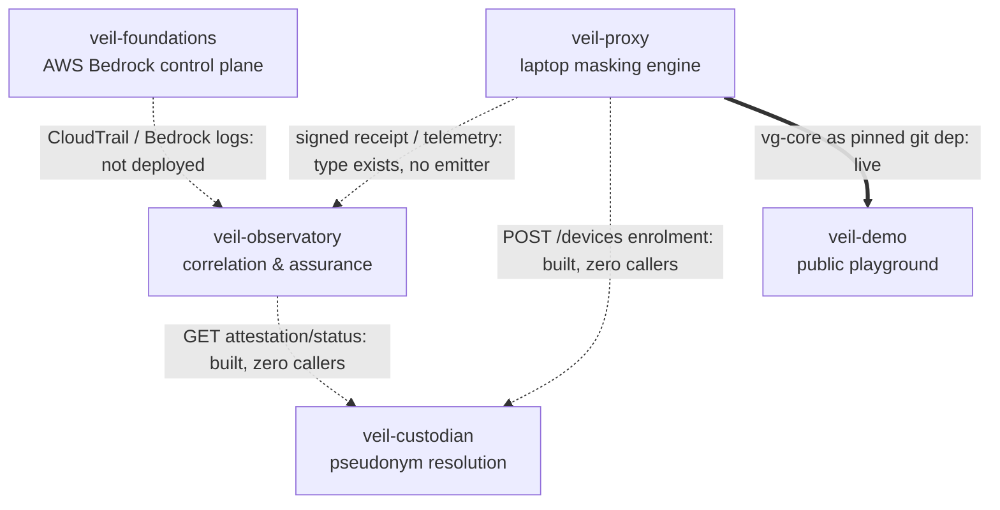

# Architecture: Veil Ecosystem

**Status:** living document. First written 2026-08-24, directly answering the gap a 2026-08-22
ecosystem audit named as its own final recommendation: *"No document ties the five repos
together... write the missing architecture document."* **Correction (2026-08-24, 3rd review
cycle):** that quote was previously hyperlinked to this repo's own GitHub URL — circular, and
wrong. The audit is not a file in any repo on disk (confirmed by a full-filesystem search); it
exists only as a document the author of this repo was handed directly. This is that document.
It will drift out of date the moment any component repo changes — see
[Keeping this current](#keeping-this-current).

## Overview

**VeilGremlin** is the umbrella name for a product family aimed at one problem: keep real PII
and sensitive enterprise identifiers out of an AI coding agent's cloud context, and give
regulated organisations a way to prove that's happening. No single repo is "VeilGremlin" — it's
five components, each with its own repo, maturity level, and privacy boundary:

| Component | Repo | Role | Privacy |
|---|---|---|---|
| **veil-proxy** | [`dermdunc/veilgremlin`](https://github.com/dermdunc/veilgremlin) | Masking data plane — runs on the developer's laptop | public |
| **veil-foundations** | [`dermdunc/veil-foundations`](https://github.com/dermdunc/veil-foundations) | Terraform control plane for Amazon Bedrock | public (+ private sibling) |
| **veil-custodian** | [`dermdunc/veil-custodian`](https://github.com/dermdunc/veil-custodian) | Device-pseudonym-to-identity mapping custodian | internal |
| **veil-observatory** | [`dermdunc/veil-observatory`](https://github.com/dermdunc/veil-observatory) | Correlation and assurance plane | local-first (standalone location, outside `~/Development/hekton`; declared `privacy_boundary: local-first`, not a separate "private" value) |
| **veil-demo** | [`dermdunc/veil-demo`](https://github.com/dermdunc/veil-demo) | Public interactive demo of the masking engine | internal |

**veil-proxy's repo is still named `veilgremlin` on GitHub.** VeilGremlin was promoted from "the
name of this one repo" to "the name of the family" on 2026-07-26; the rename of the GitHub
remote itself was deliberately deferred (no second repo existed yet to disambiguate from) and
still hasn't happened. Runtime identity — the `.veilgremlin/` state directory, the
`com.veilgremlin.vault` keychain service, and the `vg` CLI binary — is intentionally unchanged
and should stay that way: those name the *product*, not the repo, so existing installs and
vaults keep working regardless of what any repo is called.

**veil-foundations was originally named `veil-walled-garden`.** Same deliverable, renamed once
per-team cost attribution and inference profiles came into scope, which "walled garden" didn't
suggest. If you see the old name in commit history or session logs of the older repos, this is
what it refers to.

## Components

### veil-proxy (repo: `veilgremlin`)

The only component that's fully built and running today: 381 tests across 10 crates (verified
2026-08-24 — an earlier draft of this doc said 270, carried over from a stale audit; see
[Keeping this current](#keeping-this-current)), a real `vg` CLI (`vg run`, `vg inspect`,
`vg diff --masked`, `vg demask`, `vg audit`), detectors, policy engine, and a SQLCipher vault.
Runs entirely on the developer's laptop with no network dependency in its hot path.

- **Owns:** parse → detect → mask → vault → policy → masked pack, plus local demask.
- **Explicitly does not:** decide fleet-wide policy, aggregate telemetry across machines,
  authenticate its own actor (`--actor`/`--role` are self-asserted, not authenticated), or gate
  *whether* a Bedrock call is allowed at all (that's veil-foundations — veil-proxy only
  minimises *what's in* a call it's already permitted to make).
- **Gaps:** no cryptographic signing anywhere in the pipeline — the audit log
  (`crates/vg-audit/src/lib.rs`) is append-only with fsync, corrupt-line, and duplicate-ID
  detection, but has no hash chain (unlike veil-custodian's audit log, which does — don't read
  "tamper-evident" here as comparable to that), and the policy-pack "signature" field is a
  hardcoded placeholder that always verifies. **Correction (2026-08-24):** a real telemetry
  subsystem now exists — not one file but **ten**, `crates/vg-core/src/telemetry/`, 2,743 lines
  total (`envelope.rs`, `receipt.rs`, `ids.rs`, `mod.rs`, `edge_event.rs`, `aggregator.rs`,
  `pseudonymize.rs`, `block_reason.rs`, `reject.rs`, `alert.rs`). Its `TelemetryEvent` enum is a
  tested, `#[non_exhaustive]` type with `Receipt`/`Alert`/`EdgeEvent` variants. It's mid-flight,
  not finished: the latest commit as of 2026-08-24 is "telemetry roadmap Phase 3 (partial) —
  trace-id threading + aggregator skeleton." What's still genuinely missing is the network
  emitter: the module's own doc comment states its current value is "the exhaustive,
  compiler-enforced conversion and the zero-`String`, non-raw-capable payload types
  themselves — not a working emitter, which is separate, larger, not-yet-scoped work" (an
  earlier draft of this doc elided "not-yet-scoped" and the "zero-`String`" qualifier with
  "..." — restored verbatim here). So nothing is sent to veil-observatory yet, but the reason is
  "no sender," not "no type."

### veil-foundations

Terraform for Amazon Bedrock as a governed invocation control plane: IAM model allowlists,
invocation logging, VPC endpoints, cost attribution. Composes with veil-proxy as **defence in
depth** — veil-proxy minimises *what* goes out, veil-foundations constrains *whether it can go
out at all, and to which model*. A leak requires both a masking failure and an
invocation-authority failure; deployed alone, each is weaker in a specific, nameable way (see
`veilgremlin/docs/architecture/product-family.md` §2 for the full argument).

- **Status:** one real module (`iam-model-allowlist`, an Allow-only IAM policy) passes
  `fmt`/`validate`/`test` against a mock provider. Nothing has run against a real AWS account.
- **Correction (2026-08-24):** an earlier draft of this doc claimed the module makes a Bedrock
  Guardrail mandatory per invocation, contradicting the family's decided no-Guardrails policy
  (ADR-0001 in veil-observatory, ADR-010 in veil-foundations, superseding ADR-004). That was
  true of an *older* version of this module — **ADR-010 already fixed it, on 2026-08-23**,
  before this doc's own "as of 2026-08-24" claim, which is exactly the kind of drift this doc
  exists to catch and instead briefly reproduced. `main.tf` now reads, verbatim: *"Allow only,
  scoped to the entry's authorized resources, no guardrail condition of any kind."* There is no
  outstanding defect here. The no-Guardrails policy itself is real and correctly described.

### veil-custodian

Holds the mapping between opaque device pseudonyms and real device/user identity, so
veil-observatory can key everything on a pseudonym and never touch identity itself.
Pseudonym resolution is a separate, explicit, authorised, audited act — the same
opaque-reference / access-controlled-store / explicit-resolution discipline veil-proxy already
applies to *content* (`MappingRef` → vault → `rehydrate`, gated by policy), applied here to
*identity* instead. Device attestation is decided as **mTLS device certificates**
(2026-07-26).

- **Status (corrected 2026-08-24):** an earlier draft of this doc said the HTTP service was
  "100% unbuilt." That was true of the 2026-08-22 audit this doc was sourced from and stopped
  being true the next day: **a real service landed 2026-08-23** — `src/main.rs` binds a TCP
  listener and runs `axum::serve` against a real Postgres pool; `src/api/mod.rs` wires 8 routes
  to real handlers: `POST /v1/devices` (enrolment), `POST /v1/devices/{pseudonym}/revoke`,
  **`POST`+`GET /v1/resolutions`** (the actual pseudonym-resolution operation — see below),
  `GET /v1/attestation/status`, certificate renewal, CRL, and two health endpoints. (An earlier
  draft of this correction said "7 routes... cert issuance/renewal" — undercounted by one and
  wrong about renewal being a pair; certificate *issuance* happens as a byproduct of enrolment,
  not a separate route, and `/v1/resolutions` was dropped entirely despite being the component's
  headline operation.) `src/ca/mod.rs` implements mTLS CSR issuance (426 lines). The resolution
  audit log (`src/audit_log/mod.rs`, 745 lines, hash-chained, append-only, plus a Postgres-backed
  variant in `src/audit_log/postgres.rs`) is real and tested — `attestation/status` answers "is
  this pseudonym's cert valid," never "who is this," and veil-observatory's service identity is
  structurally denied any grant on the resolution API itself.
- **Gap:** the service exists but has **zero callers** — nothing in veil-proxy or
  veil-observatory invokes it yet, including `/v1/resolutions` itself (see
  [Integration Status](#integration-status)). **Correction (2026-08-24, 3rd review cycle):** its
  Postgres-backed tests were undercounted at "15... in 2 files" — actually **19, across 3
  targets**: 11 in `src/store/postgres.rs`, 4 in `src/audit_log/postgres.rs`, and 4 more in a
  separate integration-test binary, `tests/db_grants.rs` (which proves an INSERT-only Postgres
  grant on the resolution audit log via a second DB connection as `custodian_app` — a real,
  substantive test, not boilerplate). All 19 require a live database via `DATABASE_URL`, not
  documented in this repo's own `docs/setup.md` — see [setup.md](setup.md) here for the caveat,
  including why the default `cargo test` invocation never even reaches `db_grants`.

### veil-observatory

The correlation and assurance plane: ingests Bedrock/CloudTrail evidence, veil-proxy telemetry
receipts, and device-pseudonym attestation to surface residual PII exposure, missing controls,
and EU AI Act risk signals. Lives outside `~/Development/hekton` at
`~/Development/veil-observatory` — graduated to a standalone-external product location; see its
own `docs/decisions/ADR-0002-standalone-product-location.md`. Must run and be understood with
zero Hekton processes running (`ADR-0003-hekton-runtime-independence.md`) — Hekton is
build-time provenance/orchestration only, never a runtime dependency of the product itself.

- **Status:** the most complete component by test count — 491 pytest-collected items (**not**
  491 independent test functions — heavy parametrization, especially in the fitness-test suite,
  which alone contributes 209 items from 19 functions; 256 unique test functions exist
  ecosystem-wide in this repo), seven detector *modules*, though only six are wired into the
  default detector registry — the seventh, `RetroactiveTraceContestDetector`, is invoked
  directly by the correlator for a correlation-driven special case, not through the registry
  (the registry module's own docstring, itself stale, says "five detectors" — three different
  numbers for one thing). A two-tier correlator, a working evidence-pack CLI. Local storage is
  hash-chained, but only for finding history, and by the module's own comment the chain is
  unkeyed and stored alongside the data it protects — "anyone who can edit a finding can
  recompute the whole chain," not a control against a privileged local attacker. Two distinct
  defects were caught and closed by adversarial review, not one: a `prohibited_practice`
  detector *design* that never shipped (caught pre-merge), and a real, shipped
  re-identification vulnerability (unsalted, truncated SHA-256 pseudonymisation, recoverable by
  dictionary attack) that was fixed with regression coverage.
- **Gaps, corrected (2026-08-24, 3rd review cycle):** two claims here were wrong, not just
  stale. **Signature verification is not a structural stub** — a real verifier exists
  (`adapters/verification.py`, `HmacReceiptVerifier`): constant-time MAC comparison, a 24-hour
  replay window, minimum key length enforcement, explicit rejection of unsupported algorithms,
  57 tests. The stub only applies as a fallback when the `VEIL_RECEIPT_KEY` environment variable
  is unset. (This repo's own `correlation/correlator.py` and `docs/decisions/ADR-0016` still
  assert the old stub posture — stale in-repo self-description, the same failure mode this
  document exists to catch, now caught one level removed.) **The receipt schema is not an
  unreconciled guess** — a cross-repo reconciliation between veil-proxy and veil-observatory was
  **ratified 2026-08-23** (`contracts/README.md`): the draft `veil.receipt.v1` is superseded,
  pending veil-proxy publishing a generated `veil.receipt.v2` / `veil.alert.v1` /
  `veil.edge_event.v1` artifact — which veil-proxy's `telemetry/envelope.rs` already encodes as
  a `SchemaVersion` enum, even though nothing is emitted over the wire yet. What's still
  genuinely true: nothing calls veil-custodian anywhere (pseudonymisation is done locally and
  independently instead), and everything has run against synthetic fixtures only — no real AWS
  deployment, no real evidence replay.

### veil-demo

Public interactive demo — paste text, watch PII get masked and demasked in real time against
the real `vg-core` engine (not a mock). The one component with a live, deployed URL.

- **Status:** live at [veil-demo.fly.dev](https://veil-demo.fly.dev/), two machines in `lhr`,
  scale-to-zero on idle. `/`, `/pitch`, and `/api/session` verified live. Terraform owns app
  existence, `fly deploy` owns releases.
- **Relationship to veil-proxy:** pulls **six** veilgremlin crates in as pinned git dependencies
  (`vg-core`, `vg-vault`, `vg-detectors`, `vg-parsers`, `vg-policy`, `vg-audit` — not just
  `vg-core` alone, corrected 2026-08-24). This is, as of 2026-08-24, **the only one of the five
  designed cross-repo integrations that's actually wired and running** — but the pin is dated
  2026-08-02, about three weeks behind veilgremlin's current HEAD (2026-08-24). Concretely: the
  live demo runs a `vg-core` that predates the entire telemetry subsystem described above.
  "Wired and running" describes the integration mechanism, not currency with veil-proxy's
  latest capabilities. See [Integration status](#integration-status) below.

## Data Flow and Trust Boundaries

The central design tension, and how it's resolved (full argument in
`veilgremlin/docs/architecture/product-family.md` §3): veil-proxy's existing claim is *"the
cloud model sees placeholders, not the values behind them"* — true, and about what the model
sees. But a fleet-wide observatory implies something leaves the laptop, which an older, stronger
claim ("PII never leaves the machine") doesn't survive. The resolution is to split what's
unconditional from what's opt-in:

**Never crosses the boundary, unconditionally — with or without veil-observatory deployed,
regardless of policy or role:**
- The SQLCipher vault itself: the database file, its encryption key, the OS-keychain wrap.
- Any raw detected value, in any form — plaintext, hashed-but-reversible, or otherwise.
- The full, unmasked request or response body, in whole or in part.

**Can cross the boundary, only if an organisation opts into veil-observatory:** masked
telemetry — entity-type counts, policy decisions and their version, opaque mapping references,
block reasons, demask request/decision records, latency measurements, and a device pseudonym
(never a hostname or username — those are enterprise-sensitivity-class data under the project's
own taxonomy, and shipping one to an observatory would be a small version of the exact leak
this product exists to prevent). **Correction (2026-08-24, 3rd review cycle):** an earlier draft
said demask records carry "actor id" — imprecise in a way that reads as contradicting the
device-pseudonym rule two lines above it. What actually crosses is an `ActorPseudonym`
(`telemetry/edge_event.rs`) — a keyed HMAC-SHA256 over a canonicalised actor identifier
(`telemetry/pseudonymize.rs`), never a raw id. What the actor identifier *is* today: whatever
string an operator types to `vg demask --actor <STRING>` — free-typed, unvalidated, not
necessarily tied to OS or account identity at all (the source code's own comment names "a
non-ASCII OS username" only as a hypothetical future case this pseudonymisation doesn't yet
handle, not the current source).

The enforcement mechanism is a purpose-built `TelemetryEvent` type in veil-proxy — it exists
today (`crates/vg-core/src/telemetry/mod.rs`, landed 2026-08-23/24). **Correction (2026-08-24,
2nd review cycle):** an earlier draft of this section overstated the construction guarantee as
"constructible only via a reviewed, exhaustive conversion from `AuditEvent`" — the type's own
doc comment is more careful than that: it also exposes `pub(crate)` direct constructors
(`new_receipt`/`new_alert`/`new_edge_event`) for code that already holds a valid `Envelope` +
payload pair, bypassing the `AuditEvent` conversion. The module's comment calls the
conversion-based path the "sole intended construction path **in practice**," not one Rust's
type system actually forecloses — a real, acknowledged limit, not a design flaw introduced by
this doc's earlier overclaim. **What doesn't exist yet is the emitter itself** — the code that
takes a `TelemetryEvent` and actually sends it over the network to veil-observatory. Nothing is
transmitted yet, regardless of construction path.

## Integration Status

Five cross-repo integrations are called for by the design (per the 2026-08-22 audit's own named
list). As of 2026-08-24 (re-verified against the actual repos — see
[Keeping this current](#keeping-this-current)), **one is real; four are still designed-but-
uncalled or missing** — but two of the "unbuilt" callees have grown real implementations since
the audit, so "no caller yet" is now the more accurate frame than "unbuilt" for those two.

| Integration | Status |
|---|---|
| veil-proxy → veil-observatory (signed telemetry receipt) | **Missing.** `TelemetryEvent` type exists and is tested; no network emitter exists, so nothing is sent. |
| veil-foundations → veil-observatory (CloudTrail / Bedrock logs) | **Missing.** No real AWS account has been touched. |
| veil-observatory → veil-custodian (`attestation/status` query) | **Callee built, no caller.** The endpoint is live in veil-custodian (real axum route, real handler); nothing in veil-observatory invokes it yet. |
| veil-proxy → veil-custodian (`POST /devices` enrolment) | **Callee built, no caller.** The endpoint is live in veil-custodian; nothing in veil-proxy invokes it yet. |
| veil-proxy → veil-demo (`vg-core` as a pinned git dependency) | **Built and live.** The one real integration today. |

**Not on the five-integration list above, but worth naming — and, per the 3rd review cycle,
more complete than the 2nd correction stated:** veil-custodian's real API surface has four more
endpoints no other repo calls: `/v1/resolutions` (the actual pseudonym-resolution operation),
device revocation, certificate renewal, and the certificate-revocation list (CRL). The CRL
endpoint is not merely unlisted — veil-custodian's own authorization code (`src/authz/mod.rs`)
grants `Role::Observatory` exactly two capabilities: `attestation/status` (listed in the table
above) **and `/v1/certificates/crl`** (not listed anywhere in this document until now). So the
observatory→custodian relationship is under-specified above: it's designed to make two calls,
not one.

## Where the seams are

Ranked by how much downstream work is blocked on each one closing (from the 2026-08-22 audit,
reconciled against live repo state 2026-08-24):

1. **No emitter, even though the wire format itself is now settled.** **Correction (2026-08-24,
   3rd review cycle):** this seam was described as "no wire format... the consumer's schema is
   still an untested guess" — stale. The schema was reconciled and ratified 2026-08-23 (see
   Sequencing item 2 below); the producer has a real, type-safe payload (`TelemetryEvent`)
   matching it. What's actually missing is narrower: nobody has built the code that sends one
   over the network. Still the single blocker that makes every other integration moot — just a
   smaller blocker than previously described.
2. **No cryptographic trust between the two ends, though one end is real.** veil-proxy's
   "signed receipt" is genuinely a stub — no signing exists in its pipeline (see the veil-proxy
   component section). **Correction (2026-08-24, 3rd review cycle):** veil-observatory's
   receipt *verifier* is not a stub — a real HMAC-based verifier with replay protection exists.
   But a working verifier with nothing real to verify (veil-proxy emits no signed receipts yet)
   still means the assurance half of an assurance plane can't be exercised end-to-end today —
   the gap is "no signer," not "no verifier."
3. **veil-custodian's API has zero callers, despite the API itself now being real.** As of
   2026-08-23 this is no longer "a contract with no implementation" — it's a running service
   nobody calls. That's a smaller gap than it was, but still a gap: neither veil-proxy's device
   enrolment nor veil-observatory's attestation check actually happens.
4. **veil-foundations produces none of the evidence veil-observatory assumes.** No sandbox AWS
   account has been touched; every finding so far is against synthetic fixtures.
5. **Demask authorisation is open ecosystem-wide.** Actor/role attribution is self-asserted,
   not authenticated, at the one point "invisible governance" could be silently bypassed.
6. **No document tied the five repos together — until this one.** Two plan docs elsewhere in
   the ecosystem were already named like ecosystem architecture ("aws-phase2," "entity-graph")
   and turned out to be about unrelated internals; that's an early symptom of the same gap.

## Sequencing to close them

A recommendation, open to redirect, carried over from the audit and consistent with the
dependency order in `veilgremlin/docs/architecture/product-family.md` §9:

1. ~~Ship veil-demo~~ — **done**, live at veil-demo.fly.dev.
2. ~~Freeze the receipt/telemetry contract~~ — **corrected 2026-08-24, 3rd review cycle:
   further along than "freeze," already done.** A cross-repo reconciliation between veil-proxy
   and veil-observatory was ratified 2026-08-23 (`veil-observatory/contracts/README.md`):
   `veil.receipt.v1` is superseded, and the target shape (`veil.receipt.v2` / `veil.alert.v1` /
   `veil.edge_event.v1`) is already encoded in veil-proxy's `telemetry::SchemaVersion` enum.
   What remains of this step is narrower than "freeze a contract" — it's "finish implementing
   the already-agreed one."
3. **Build the emitter, retire the fixtures.** The `TelemetryEvent` type and its target schema
   both exist — build the network sender in veil-proxy that actually transmits one; switch
   veil-observatory's ingestion off synthetic fixtures onto real receipts.
4. **Wire one real custodian call.** veil-custodian's `attestation/status` and `/certificates/crl`
   endpoints are real, running services as of 2026-08-23 — have veil-observatory call either for
   real. This proves the "observatory never touches identity" boundary structurally, not just on
   paper.
5. **Stand up one sandbox AWS account.** Apply veil-foundations' one real module against it,
   then extend to invocation logging. (The Guardrail-mandatory defect an earlier draft of this
   doc flagged here was already fixed via ADR-010 on 2026-08-23 — nothing left to fix before
   this step.)
6. **Build the signer.** veil-observatory's receipt *verifier* already exists and is real
   (corrected 2026-08-24) — what's missing is the signer on veil-proxy's end. Building it once
   the wire format is stable (step 2, already largely settled) avoids signing a schema that's
   still moving.
7. ~~Write the missing architecture document~~ — **done: this document.** Keeping it current is
   now the open item; see below.

**Also unresolved and load-bearing for anything fleet-shaped:** real device/actor identity
(§6 of the product-family doc) is architected — opaque pseudonym minted at enrolment, held by
veil-custodian, mTLS-attested — but the cryptographic attestation mechanism's implementation,
MDM enrolment mechanics, and the still-open dashboard-repo-location question (does
`veil-dashboard` live inside veil-observatory, or get its own repo?) are all open. See
`veilgremlin/docs/architecture/product-family.md` §10 for the full list of open questions this
document doesn't re-litigate.

## Running the ecosystem today

See [setup.md](setup.md) for what's actually runnable per component, honestly scoped against
the integration status above — most components run standalone today; almost nothing runs
*together* yet, because the wiring between them (seam #1 above) doesn't exist.

## Keeping this current

**This document was itself stale on the day it was written, and that's the lesson to carry
forward, not just a footnote.** The first draft (2026-08-24) was synthesised from a 2026-08-22
audit and never independently re-checked against the component repos before publishing. A
doubt-driven-development review cycle the same day caught three load-bearing errors this
caused — a defect claimed against veil-foundations that ADR-010 had already fixed the day
before, a veil-custodian service claimed unbuilt that had already shipped, and a veil-proxy
`TelemetryEvent` type claimed nonexistent that already existed — all from real commits that
landed in the two days between the audit and this doc. See `docs/decisions.md` for the full
record of what was wrong and how it was corrected.

The takeaway: **synthesising from a point-in-time audit is not the same as verifying against
current repo state, even a few days later, in a fast-moving family of repos.** Whoever lands
changes in the sequencing above should update the relevant sections here in the same PR — and
should verify against the actual repo, not against this document's own prior claims — starting
with [Integration Status](#integration-status), the section most likely to go stale next.

**A 3rd review cycle (2026-08-24, paired: an independent-model reviewer's findings each
cross-verified by a second, different model against the repos directly) found a sharper version
of the same lesson: two of its findings were cases where this document correctly copied a claim
from a component repo's *own* documentation — which had itself gone stale relative to that
repo's code** (veil-observatory's `correlation/correlator.py` and `ADR-0016` still assert a
"structural stub" signature verifier that a real implementation had already superseded; this
document's receipt-schema claim was carried over the same way, missing a cross-repo
reconciliation ratified the day before). "Verify against the actual repo" has to mean the
code, not any repo's prose about itself — a component's own docs are exactly the kind of
secondary source this document's first correction already learned not to trust uncritically.
The 3rd cycle also caught a structurally different class of error the first two didn't: a
misplaced/circular citation link, an elided quote that dropped load-bearing words, and a section
that referred to content below it as though it were above. See `docs/decisions.md` for the full
list.
