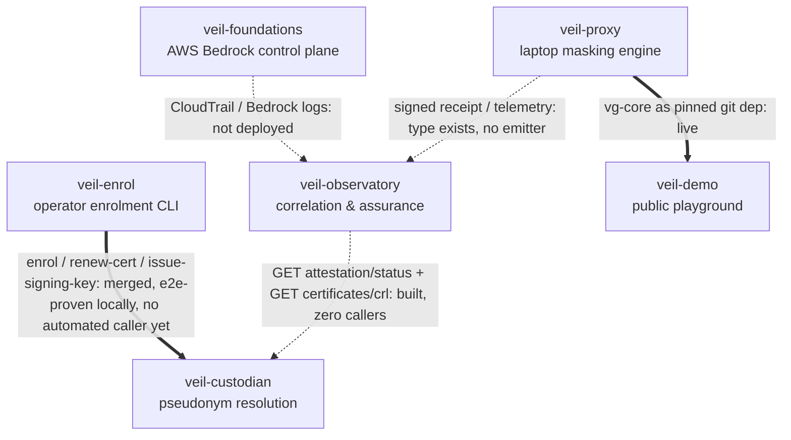

# Architecture: Veil Ecosystem

**Status:** living document. First written 2026-08-24, directly answering the gap a 2026-08-22
ecosystem audit named as its own final recommendation: *"No document ties the five repos
together... write the missing architecture document."* **Correction (2026-08-24, 3rd review
cycle):** that quote was previously hyperlinked to this repo's own GitHub URL — circular, and
wrong. The audit is not a file in any repo on disk (confirmed by a full-filesystem search); it
exists only as a document the author of this repo was handed directly. This is that document.
It will drift out of date the moment any component repo changes — see
[Keeping this current](#keeping-this-current).

## Overview

**VeilGremlin** is the umbrella name for a product family aimed at one problem: keep real PII
and sensitive enterprise identifiers out of an AI coding agent's cloud context, and give
regulated organisations a way to prove that's happening. No single repo is "VeilGremlin" — it's
now six components, each with its own repo, maturity level, and privacy boundary (a sixth,
**veil-enrol**, was added 2026-09-04 — see [Keeping this current](#keeping-this-current) and
the dated update below for why this table's own count has changed twice now):

| Component | Repo | Role | Repo privacy | Public surface |
|---|---|---|---|---|
| **veil-proxy** | [`dermdunc/veil-proxy`](https://github.com/dermdunc/veil-proxy) | Masking data plane — runs on the developer's laptop | public | source itself (crate git deps) |
| **veil-foundations** | [`dermdunc/veil-foundations`](https://github.com/dermdunc/veil-foundations) | Terraform control plane for Amazon Bedrock | public (declared) — **repo currently private, an unresolved mismatch, see below** | none |
| **veil-custodian** | [`dermdunc/veil-custodian`](https://github.com/dermdunc/veil-custodian) | Device-pseudonym-to-identity mapping custodian | internal (repo private, matches) | none |
| **veil-enrol** | [`dermdunc/veil-enrol`](https://github.com/dermdunc/veil-enrol) | Operator CLI holding the `enrolment-authority` credential — the sole legitimate caller of veil-custodian's device-enrolment, mTLS-renewal, and signing-key-issuance endpoints | internal (repo private, matches) | none |
| **veil-observatory** | [`dermdunc/veil-observatory`](https://github.com/dermdunc/veil-observatory) | Correlation and assurance plane | local-first (standalone location, outside `~/Development/hekton`; repo private, matches) | none |
| **veil-demo** | [`dermdunc/veil-demo`](https://github.com/dermdunc/veil-demo) | Public interactive demo of the masking engine | internal (repo private — deliberately, per the two-axis split below, not a contradiction with the next column) | `veil-demo.fly.dev` — **currently down**, see RISK-0006 |

**Two-axis privacy split, added 2026-09-04** (per `docs/interactive-plan.md`'s §3, implemented
here for the first time): repo privacy and public surface reachability are independent facts,
not one column collapsed into a single word. veil-demo is the clearest case — the *source* is
genuinely internal (matches its own `.hekton/project.yaml`, no `private_sibling` declared,
complete non-public-capable layout) while the *deployed artifact* is (or was, until RISK-0006)
publicly reachable. Collapsing those into one "internal" or one "public" value gets veil-demo
wrong in one direction or the other; the columns above are independent on purpose. The
veil-foundations row is the other live case this split makes precise: its *declared* repo
privacy and its *actual* GitHub visibility disagree — a real, still-open inconsistency, not a
rendering choice — and the "public surface" column is separately just `none` regardless of how
that gets resolved, since no Terraform module here is deployed anywhere.

**Corrected 2026-09-04: veil-proxy's GitHub repo is no longer named `veilgremlin`.** It was
renamed to `veil-proxy` on GitHub (confirmed via `gh api`, `pushed_at: 2026-09-03`) — this
document previously asserted, in this exact spot, that the rename "still hasn't happened,"
which was accurate when written (2026-08-24) and had already gone stale by the time a
2026-09-04 review caught it, a decent illustration of why "as of `<date>`" claims in this
document need re-verifying, not re-reading. **The local checkout directory is still named
`veilgremlin`** (`factory-output/veilgremlin/`) and has not been renamed to match — a live,
disclosed inconsistency between GitHub-side and local-side naming, not an oversight to quietly
fix by editing this sentence. VeilGremlin was promoted from "the name of this one repo" to "the
name of the family" on 2026-07-26; runtime identity — the `.veilgremlin/` state directory, the
`com.veilgremlin.vault` keychain service, and the `vg` CLI binary — is intentionally unchanged
and should stay that way: those name the *product*, not the repo, so existing installs and
vaults keep working regardless of what any repo or local directory is called.

**veil-foundations was originally named `veil-walled-garden`.** Same deliverable, renamed once
per-team cost attribution and inference profiles came into scope, which "walled garden" didn't
suggest. If you see the old name in commit history or session logs of the older repos, this is
what it refers to.

## Components

### veil-proxy (GitHub repo: `veil-proxy`, local checkout directory: `veilgremlin`)

The only component that's fully built and running today: 381 tests across 10 crates (verified
2026-08-24 — an earlier draft of this doc said 270, carried over from a stale audit; see
[Keeping this current](#keeping-this-current)), a real `vg` CLI (`vg run`, `vg inspect`,
`vg diff --masked`, `vg demask`, `vg audit`), detectors, policy engine, and a SQLCipher vault.
Runs entirely on the developer's laptop with no network dependency in its hot path.

- **Owns:** parse → detect → mask → vault → policy → masked pack, plus local demask.
- **Explicitly does not:** decide fleet-wide policy, aggregate telemetry across machines,
  authenticate its own actor (`--actor`/`--role` are self-asserted, not authenticated), or gate
  *whether* a Bedrock call is allowed at all (that's veil-foundations — veil-proxy only
  minimises *what's in* a call it's already permitted to make).
- **Gaps:** no cryptographic signing anywhere in the pipeline — the audit log
  (`crates/vg-audit/src/lib.rs`) is append-only with fsync, corrupt-line, and duplicate-ID
  detection, but has no hash chain (unlike veil-custodian's audit log, which does — don't read
  "tamper-evident" here as comparable to that), and the policy-pack "signature" field is a
  hardcoded placeholder that always verifies. **Correction (2026-08-24):** a real telemetry
  subsystem now exists — not one file but **ten**, `crates/vg-core/src/telemetry/`, 2,743 lines
  total (`envelope.rs`, `receipt.rs`, `ids.rs`, `mod.rs`, `edge_event.rs`, `aggregator.rs`,
  `pseudonymize.rs`, `block_reason.rs`, `reject.rs`, `alert.rs`). Its `TelemetryEvent` enum is a
  tested, `#[non_exhaustive]` type with `Receipt`/`Alert`/`EdgeEvent` variants. It's mid-flight,
  not finished: the latest commit as of 2026-08-24 is "telemetry roadmap Phase 3 (partial) —
  trace-id threading + aggregator skeleton." What's still genuinely missing is the network
  emitter: the module's own doc comment states its current value is "the exhaustive,
  compiler-enforced conversion and the zero-`String`, non-raw-capable payload types
  themselves — not a working emitter, which is separate, larger, not-yet-scoped work" (an
  earlier draft of this doc elided "not-yet-scoped" and the "zero-`String`" qualifier with
  "..." — restored verbatim here). So nothing is sent to veil-observatory yet, but the reason is
  "no sender," not "no type."

### veil-foundations

Terraform for Amazon Bedrock as a governed invocation control plane: IAM model allowlists,
invocation logging, VPC endpoints, cost attribution. Composes with veil-proxy as **defence in
depth** — veil-proxy minimises *what* goes out, veil-foundations constrains *whether it can go
out at all, and to which model*. A leak requires both a masking failure and an
invocation-authority failure; deployed alone, each is weaker in a specific, nameable way (see
`veilgremlin/docs/architecture/product-family.md` §2 for the full argument).

- **Status:** one real module (`iam-model-allowlist`, an Allow-only IAM policy) passes
  `fmt`/`validate`/`test` against a mock provider. Nothing has run against a real AWS account.
- **Correction (2026-08-24):** an earlier draft of this doc claimed the module makes a Bedrock
  Guardrail mandatory per invocation, contradicting the family's decided no-Guardrails policy
  (ADR-0001 in veil-observatory, ADR-010 in veil-foundations, superseding ADR-004). That was
  true of an *older* version of this module — **ADR-010 already fixed it, on 2026-08-23**,
  before this doc's own "as of 2026-08-24" claim, which is exactly the kind of drift this doc
  exists to catch and instead briefly reproduced. `main.tf` now reads, verbatim: *"Allow only,
  scoped to the entry's authorized resources, no guardrail condition of any kind."* There is no
  outstanding defect here. The no-Guardrails policy itself is real and correctly described.

### veil-custodian

Holds the mapping between opaque device pseudonyms and real device/user identity, so
veil-observatory can key everything on a pseudonym and never touch identity itself.
Pseudonym resolution is a separate, explicit, authorised, audited act — the same
opaque-reference / access-controlled-store / explicit-resolution discipline veil-proxy already
applies to *content* (`MappingRef` → vault → `rehydrate`, gated by policy), applied here to
*identity* instead. Device attestation is decided as **mTLS device certificates**
(2026-07-26).

- **Status (corrected 2026-08-24):** an earlier draft of this doc said the HTTP service was
  "100% unbuilt." That was true of the 2026-08-22 audit this doc was sourced from and stopped
  being true the next day: **a real service landed 2026-08-23** — `src/main.rs` binds a TCP
  listener and runs `axum::serve` against a real Postgres pool; `src/api/mod.rs` wires 8 routes
  to real handlers: `POST /v1/devices` (enrolment), `POST /v1/devices/{pseudonym}/revoke`,
  **`POST`+`GET /v1/resolutions`** (the actual pseudonym-resolution operation — see below),
  `GET /v1/attestation/status`, certificate renewal, CRL, and two health endpoints. (An earlier
  draft of this correction said "7 routes... cert issuance/renewal" — undercounted by one and
  wrong about renewal being a pair; certificate *issuance* happens as a byproduct of enrolment,
  not a separate route, and `/v1/resolutions` was dropped entirely despite being the component's
  headline operation.) `src/ca/mod.rs` implements mTLS CSR issuance (426 lines). The resolution
  audit log (`src/audit_log/mod.rs`, 745 lines, hash-chained, append-only, plus a Postgres-backed
  variant in `src/audit_log/postgres.rs`) is real and tested — `attestation/status` answers "is
  this pseudonym's cert valid," never "who is this," and veil-observatory's service identity is
  structurally denied any grant on the resolution API itself.
- **Gap:** the service exists but has **zero callers** — nothing in veil-proxy or
  veil-observatory invokes it yet, including `/v1/resolutions` itself (see
  [Integration Status](#integration-status)). **Correction (2026-08-24, 3rd review cycle):** its
  Postgres-backed tests were undercounted at "15... in 2 files" — actually **19, across 3
  targets**: 11 in `src/store/postgres.rs`, 4 in `src/audit_log/postgres.rs`, and 4 more in a
  separate integration-test binary, `tests/db_grants.rs` (which proves an INSERT-only Postgres
  grant on the resolution audit log via a second DB connection as `custodian_app` — a real,
  substantive test, not boilerplate). All 19 require a live database via `DATABASE_URL`, not
  documented in this repo's own `docs/setup.md` — see [setup.md](setup.md) here for the caveat,
  including why the default `cargo test` invocation never even reaches `db_grants`.
- **New gap, found 2026-09-04 running veil-enrol's end-to-end script against a real
  instance (see the veil-enrol section below):** `device_mapping`'s UNIQUE index on
  `device_binding` (`migrations/0002_device_mapping.sql`) isn't covered by the enrolment
  store's `INSERT ... ON CONFLICT (enrolment_authority_ref)` clause — a `device_binding`
  collision (a realistic operator mistake, e.g. reusing an MDM device ID) surfaces as an
  unhandled Postgres error, not the clean 409 other conflict paths document. Not fixed —
  tracked in veil-enrol's `docs/next-actions.md`, this repo's actual problem to fix. Also
  new since the 2026-08-30 audit: ADR-S (Milestone 7) shipped and merged to `main`
  2026-08-31/09-03 — two more real, routed, authorised endpoints not reflected in this
  section's route count above, `POST /v1/devices/{pseudonym}/signing-keys`
  (`EnrolmentAuthority`-gated, same role as enrolment/renewal) and
  `GET /v1/signing-keys/{key_ref}` (`Observatory`-gated, same role as `attestation/status`
  and `certificates/crl` — a third grant for that role, not two as this section's own count
  above still implies). See the [Integration Status](#integration-status) table below,
  updated for this change.

### veil-enrol

**New 2026-09-04.** A single-shot operator CLI, never a daemon — the missing piece
ADR-D/ADR-N (veil-custodian's own decision log, 2026-07-26/2026-08-23) name but leave
unbuilt: "a device never calls the custodian; only the enrolment authority and the
resolution authority do." Before this repo existed, that meant veil-custodian's enrolment,
mTLS-renewal, and (as of ADR-S, 2026-08-31) signing-key-issuance endpoints were real,
routed, and authorised — but had no legitimate caller anywhere in the family. veil-enrol is
that caller: it holds the `enrolment-authority` credential (OS keychain or a
permission-checked file, mirroring veilgremlin's own `vg-vault` pattern) and exposes seven
subcommands — three mutating (`enrol`, `renew-cert`, `issue-signing-key`, each writing a
local issuance receipt), three non-mutating (`csr-check`, `whoami`, `config check`), and one
local-only (`expiring`, the answer to the 30-day signing-cert cliff — no server-side
discovery endpoint exists for this yet).

- **Status:** v1 built 2026-09-04, `dermdunc/veil-enrol` PR #2, **merged to `main`
  2026-09-04.** 15 commits, two doubt-driven-development rounds (crypto core, then the full
  CLI; 18 combined findings, all fixed) against a repo scaffolded fresh for this purpose.
  Merging closes the "PR unmerged" gap named below but not the other two: there is still no
  on-device CSR-generation story and no MDM invokes it automatically — an operator still
  runs it by hand. It never generates
  or sees a device private key — it validates and relays a CSR the device already produced,
  the same discipline ADR-M applies on veil-custodian's side, enforced here by both unit
  tests and a source-text structural test (`tests/structural.rs`) confirming no
  key-generation symbol is reachable from its CSR-handling path and that `rcgen` isn't even
  a dependency.
- **The first real proof the ADR-D/ADR-N/ADR-S trust chain closes end-to-end, anywhere in
  this family:** `scripts/dev-e2e.sh` drives a real openssl-generated device CSR through a
  real local veil-custodian instance (not a mock) — `csr-check` → `enrol` →
  `issue-signing-key` → `renew-cert` → `expiring` — and verifies the issued signing
  certificate's SAN/EKU/KU/SPKI match ADR-S's profile exactly, byte-for-byte via
  `openssl x509 -text`. Run twice consecutively to confirm repeatability. This is a **local
  proof, not a production caller** — see [Integration Status](#integration-status).
- **What it is not:** a device-side binary (an earlier 3-way disagreement in this repo's own
  planning process considered and rejected shipping one — see veil-enrol's own
  `docs/decisions.md`, ADR-VE-001), and not the eventual production enrolment path either —
  `docs/next-actions.md` here and in veilgremlin both still name the real long-term home for
  on-device CSR generation as a future `vg-cli` keychain-writer subcommand
  (`vg enrol request-csr`), not yet built anywhere.
- **Explicitly deferred in v1**, tracked in its own `docs/next-actions.md`: a
  `renew-signing-key` subcommand (veil-custodian has no renewal endpoint for signing keys
  yet, only mTLS certs); contract-fixture drift-check automation; two accepted, documented
  `cargo-deny` advisories (`rustls-pemfile`, `async-std`, both unmaintained-not-vulnerable).
  A real veil-custodian bug was found running the e2e script, not fixed here (different
  repo's problem, noted in the veil-custodian section above): `device_mapping`'s UNIQUE
  index on `device_binding` isn't covered by the store's `ON CONFLICT` clause, so a
  collision (a realistic operator mistake — reusing an MDM device ID) surfaces as an
  unhandled 500, not a clean 409.

### veil-observatory

The correlation and assurance plane: ingests Bedrock/CloudTrail evidence, veil-proxy telemetry
receipts, and device-pseudonym attestation to surface residual PII exposure, missing controls,
and EU AI Act risk signals. Lives outside `~/Development/hekton` at
`~/Development/veil-observatory` — graduated to a standalone-external product location; see its
own `docs/decisions/ADR-0002-standalone-product-location.md`. Must run and be understood with
zero Hekton processes running (`ADR-0003-hekton-runtime-independence.md`) — Hekton is
build-time provenance/orchestration only, never a runtime dependency of the product itself.

- **Status:** the most complete component by test count — 491 pytest-collected items (**not**
  491 independent test functions — heavy parametrization, especially in the fitness-test suite,
  which alone contributes 209 items from 19 functions; 256 unique test functions exist
  ecosystem-wide in this repo), seven detector *modules*, though only six are wired into the
  default detector registry — the seventh, `RetroactiveTraceContestDetector`, is invoked
  directly by the correlator for a correlation-driven special case, not through the registry
  (the registry module's own docstring, itself stale, says "five detectors" — three different
  numbers for one thing). A two-tier correlator, a working evidence-pack CLI. Local storage is
  hash-chained, but only for finding history, and by the module's own comment the chain is
  unkeyed and stored alongside the data it protects — "anyone who can edit a finding can
  recompute the whole chain," not a control against a privileged local attacker. Two distinct
  defects were caught and closed by adversarial review, not one: a `prohibited_practice`
  detector *design* that never shipped (caught pre-merge), and a real, shipped
  re-identification vulnerability (unsalted, truncated SHA-256 pseudonymisation, recoverable by
  dictionary attack) that was fixed with regression coverage.
- **Gaps, corrected (2026-08-24, 3rd review cycle):** two claims here were wrong, not just
  stale. **Signature verification is not a structural stub** — a real verifier exists
  (`adapters/verification.py`, `HmacReceiptVerifier`): constant-time MAC comparison, a 24-hour
  replay window, minimum key length enforcement, explicit rejection of unsupported algorithms,
  57 tests. The stub only applies as a fallback when the `VEIL_RECEIPT_KEY` environment variable
  is unset. (This repo's own `correlation/correlator.py` and `docs/decisions/ADR-0016` still
  assert the old stub posture — stale in-repo self-description, the same failure mode this
  document exists to catch, now caught one level removed.) **The receipt schema is not an
  unreconciled guess** — a cross-repo reconciliation between veil-proxy and veil-observatory was
  **ratified 2026-08-23** (`contracts/README.md`): the draft `veil.receipt.v1` is superseded,
  pending veil-proxy publishing a generated `veil.receipt.v2` / `veil.alert.v1` /
  `veil.edge_event.v1` artifact — which veil-proxy's `telemetry/envelope.rs` already encodes as
  a `SchemaVersion` enum, even though nothing is emitted over the wire yet. What's still
  genuinely true: nothing calls veil-custodian anywhere (pseudonymisation is done locally and
  independently instead), and everything has run against synthetic fixtures only — no real AWS
  deployment, no real evidence replay.

### veil-demo

Public interactive demo — paste text, watch PII get masked and demasked in real time against
the real `vg-core` engine (not a mock). The one component with a live, deployed URL.

- **Status:** live at [veil-demo.fly.dev](https://veil-demo.fly.dev/), two machines in `lhr`,
  scale-to-zero on idle. `/`, `/pitch`, and `/api/session` verified live. Terraform owns app
  existence, `fly deploy` owns releases.
- **Relationship to veil-proxy:** pulls **six** veilgremlin crates in as pinned git dependencies
  (`vg-core`, `vg-vault`, `vg-detectors`, `vg-parsers`, `vg-policy`, `vg-audit` — not just
  `vg-core` alone, corrected 2026-08-24). This is, as of 2026-08-24, **the only one of the five
  designed cross-repo integrations that's actually wired and running** — but the pin is dated
  2026-08-02, about three weeks behind veilgremlin's current HEAD (2026-08-24). Concretely: the
  live demo runs a `vg-core` that predates the entire telemetry subsystem described above.
  "Wired and running" describes the integration mechanism, not currency with veil-proxy's
  latest capabilities. See [Integration status](#integration-status) below.

## Data Flow and Trust Boundaries

The central design tension, and how it's resolved (full argument in
`veilgremlin/docs/architecture/product-family.md` §3): veil-proxy's existing claim is *"the
cloud model sees placeholders, not the values behind them"* — true, and about what the model
sees. But a fleet-wide observatory implies something leaves the laptop, which an older, stronger
claim ("PII never leaves the machine") doesn't survive. The resolution is to split what's
unconditional from what's opt-in:

**Never crosses the boundary, unconditionally — with or without veil-observatory deployed,
regardless of policy or role:**
- The SQLCipher vault itself: the database file, its encryption key, the OS-keychain wrap.
- Any raw detected value, in any form — plaintext, hashed-but-reversible, or otherwise.
- The full, unmasked request or response body, in whole or in part.

**Can cross the boundary, only if an organisation opts into veil-observatory:** masked
telemetry — entity-type counts, policy decisions and their version, opaque mapping references,
block reasons, demask request/decision records, latency measurements, and a device pseudonym
(never a hostname or username — those are enterprise-sensitivity-class data under the project's
own taxonomy, and shipping one to an observatory would be a small version of the exact leak
this product exists to prevent). **Correction (2026-08-24, 3rd review cycle):** an earlier draft
said demask records carry "actor id" — imprecise in a way that reads as contradicting the
device-pseudonym rule two lines above it. What actually crosses is an `ActorPseudonym`
(`telemetry/edge_event.rs`) — a keyed HMAC-SHA256 over a canonicalised actor identifier
(`telemetry/pseudonymize.rs`), never a raw id. What the actor identifier *is* today: whatever
string an operator types to `vg demask --actor <STRING>` — free-typed, unvalidated, not
necessarily tied to OS or account identity at all (the source code's own comment names "a
non-ASCII OS username" only as a hypothetical future case this pseudonymisation doesn't yet
handle, not the current source).

The enforcement mechanism is a purpose-built `TelemetryEvent` type in veil-proxy — it exists
today (`crates/vg-core/src/telemetry/mod.rs`, landed 2026-08-23/24). **Correction (2026-08-24,
2nd review cycle):** an earlier draft of this section overstated the construction guarantee as
"constructible only via a reviewed, exhaustive conversion from `AuditEvent`" — the type's own
doc comment is more careful than that: it also exposes `pub(crate)` direct constructors
(`new_receipt`/`new_alert`/`new_edge_event`) for code that already holds a valid `Envelope` +
payload pair, bypassing the `AuditEvent` conversion. The module's comment calls the
conversion-based path the "sole intended construction path **in practice**," not one Rust's
type system actually forecloses — a real, acknowledged limit, not a design flaw introduced by
this doc's earlier overclaim. **What doesn't exist yet is the emitter itself** — the code that
takes a `TelemetryEvent` and actually sends it over the network to veil-observatory. Nothing is
transmitted yet, regardless of construction path.

## Integration Status

Five cross-repo integrations were originally called for by the design (per the 2026-08-22
audit's own named list). The table below still has five rows, not six — **correction
2026-09-04, same-day self-check**: an earlier version of this paragraph said veil-enrol →
veil-custodian was "described here alongside the original five, not folded silently into an
existing row," which overclaimed what actually happened. It replaced the row that used to
read `veil-proxy → veil-custodian` (itself an architecturally-impossible edge under
ADR-D/ADR-N, corrected the same day) rather than being added as a genuine sixth row — the
row count never changed, only which edge occupies the fifth one. As of 2026-08-30, re-verified
again 2026-09-04 for this update only against the two repos it touches (see
[Keeping this current](#keeping-this-current)): **one is wired and demonstrated in production
terms (merged, cross-process, pushed to GitHub — see the table row for the pushed-status
correction); one more is now merged and locally e2e-proven but has no automated caller yet
(veil-enrol → veil-custodian, new this update); the remaining three are still
designed-but-uncalled, demonstrated-but-currently-down, or entirely missing** — not a clean
real/unreal split, see the table for each one's actual status.

**Correction (2026-09-04):** the diagram and table below previously showed
`veil-proxy → veil-custodian ("POST /devices enrolment")`. That edge was never
architecturally correct — ADR-D (2026-07-26) and ADR-N (2026-08-23), both ratified *before*
this document's original 2026-08-24 draft, establish that a device never calls the custodian
directly, for enrolment or anything else; only the enrolment authority does. This document
carried the wrong edge for its entire first ten days because no operator-authority component
existed yet to draw instead — exactly the "verify against the actual repo, not against this
document's own prior claims" failure mode named in
[Keeping this current](#keeping-this-current), this time caught by a real component finally
being built rather than by a review cycle. Replaced below with the correct caller,
veil-enrol.

Deliberately absent from this diagram: any device → veil-custodian edge. ADR-D/ADR-N forbid
it structurally, not just by convention — there is no route on veil-custodian a device could
even call.

| Integration | Status |
|---|---|
| veil-proxy → veil-observatory (signed telemetry receipt) | **Wired and demonstrated.** `EdgeEvent`, not `Receipt`; merged to `main` and pushed to GitHub on both sides (confirmed 2026-09-04 via `git rev-parse` — an earlier draft of this row said "not pushed," which was true 2026-08-29 and stale by 2026-08-30 when PR #58 actually merged to `origin/main`). See 2026-08-29 updates below. |
| veil-foundations → veil-observatory (CloudTrail / Bedrock logs) | **Missing.** No real AWS account has been touched. |
| veil-observatory → veil-custodian (`attestation/status` + `certificates/crl` + `signing-keys/{key_ref}`) | **Built, no caller.** All three endpoints are live in veil-custodian (real axum routes, real handlers, all three are the grants `Role::Observatory` actually holds — see the note below the table); nothing in veil-observatory invokes any of them yet. |
| veil-enrol → veil-custodian (`POST /devices` enrolment, `.../certificates/renew`, `.../signing-keys`) | **Built, locally proven.** veil-enrol (PR #2, merged to `main` 2026-09-04) is the real, first, and only caller of these three endpoints anywhere in the family, per ADR-D/ADR-N's own design. `scripts/dev-e2e.sh` proves the full loop against a real local veil-custodian instance, including issued-certificate profile verification. Not yet a production integration: there is no on-device CSR-generation story yet (a future veilgremlin `vg-cli` writer, not built — see the veil-enrol component section above), and no MDM actually invokes `veil-enrol` today — a human operator runs it by hand. |
| veil-proxy → veil-demo (`vg-core` as a pinned git dependency) | **Built, not live.** The pin mechanism works; the deployed instance is down. See 2026-08-30 update below. |

**Update (2026-08-29):** the veil-proxy → veil-observatory crypto/ingestion contract described
as seam #1 below is no longer purely designed-but-uncalled. Deliberately scoped narrower than
the `Receipt`/`veil.receipt.v2` this doc originally pointed at: `Receipt` still cannot be
produced in production (`TryFrom<&AuditEvent>` rejects `Scan`/`PolicyDecision` with
`RequiresAggregation`, and the aggregator remains an explicit unfinished skeleton). Instead,
`EdgeEvent` — already producible in production today from `DemaskRequest`/`DemaskDecision`/
recognized `Block` reasons — got a real wire format: `veil.edge_event.v1`. On the veil-proxy
side, `EdgeEvent`/`Envelope`/`Integrity` now serialize to canonical JSON and get HMAC-SHA256
signed (`crates/vg-core/src/telemetry/{canonical,signing}.rs`), independently field-audited
against this doc's own "never crosses the boundary" rule before implementation (every
serialized field is a closed enum, a fixed-width hash, or a bounded token — no raw string
escape hatch). On the veil-observatory side, a new `schemas/veil.edge_event.v1.schema.json`,
an `EdgeEventAdapter`, a generalized `HmacReceiptVerifier` (now verifies edge events for real,
not the stub), and a loopback HTTP receiver (`veil-observatory serve`) all exist and pass a
shared cross-language golden vector byte-for-byte — independently re-verified in this session,
not just self-reported by the builders. **What's still not true:** neither repo has this merged
to `main` or pushed (veilgremlin: local branch `worktree-agent-a9869ec2363020f3e`,
commit `1d14b13`; veil-observatory: local branch `agent/claude/edge-event-v1-ingestion`,
commit `775a219`), nothing in `vg-audit`'s `TelemetryCountingAuditSink::write` calls the signer
yet (it still discards the converted `EdgeEvent` after counting it), and there is no HTTP
*client* in veil-proxy sending anything — only a receiver on the veil-observatory side proven
against a hand-constructed record. Edge events also do not yet reach `Correlator`/
`FindingEngine`: a single unaggregated event has nothing to attach to yet, so this closes the
signing/verification half of seam #1, not the "produces a finding from real telemetry" claim.
Treat this as "the hard cryptographic contract is proven; the wiring that would make it fire
automatically is the remaining gap" — see `docs/next-actions.md`.

**Update (2026-08-29, same day, later):** the wiring landed too. Both branches merged to local
`main` in their respective repos (still unpushed), and a genuine cross-process run followed:
a real `veil-observatory serve` instance, a real signed `EdgeEvent` sent by veil-proxy's real
emitter, logged `202 Accepted` and persisted with a genuine HMAC actor pseudonym. This is now
the second real integration, after veil-proxy → veil-demo, though narrower in scope than the
five-integration list implies (`EdgeEvent`, not `Receipt`) and not yet running unattended in
production (opt-in env vars, manual trigger). **A real operational gotcha surfaced getting
there, worth naming for whoever configures this next**: `VEIL_RECEIPT_KEY` means two different
byte encodings depending which repo reads it — veil-proxy hex-decodes it, veil-observatory
UTF-8-encodes it directly. The same 32-byte key needs two different string values, one per
process; the identical string in both environments silently produces two unrelated keys with
no error on either side. See `veilgremlin/docs/build-log/2026-08-29-the-same-string-two-different-keys.md`
for the full story and `veilgremlin/crates/vg-audit/tests/live_edge_event_integration.rs` for
the exact working invocation.

**Updated 2026-09-04 — most of this note is now folded into the table above, not left
implicit here, and one part of the 3rd-cycle claim below turns out to have been
incomplete rather than wrong (`src/authz/mod.rs` defines four roles, not two, once you
read past the two this doc has tracked so far).** `attestation/status`, `certificates/crl`,
and (new, ADR-S) `GET /signing-keys/{key_ref}` are all `Role::Observatory`'s only three
grants — three, not the two this section previously named, and the observatory row above
now reflects the two live-called-nowhere ones. `POST /devices`, `.../certificates/renew`,
and (new) `.../signing-keys` are `Role::EnrolmentAuthority`-gated and are the veil-enrol row
above. **Two routes still have no caller anywhere and aren't in either row above, and each
needs its own credential — they are not the enrolment authority's to call:**
`POST /devices/{pseudonym}/revoke` is gated on a fourth, *separate* role,
`Role::RevocationAuthority` (confirmed directly in `src/api/handlers/devices.rs` — not the
same grant `enrol`/`renew_certificate`/`issue_signing_key` use, despite living in the same
file), which no component in this family holds yet — veil-enrol's own `docs/decisions.md`
scopes it to the `enrolment-authority` credential only, so growing a `revoke` subcommand
there would mean requesting a second, distinct credential, not reusing the one it already
has. `POST`+`GET /v1/resolutions` are gated on a fifth and sixth role,
`Role::ResolutionAuthority` and (the `GET` list-endpoint specifically) `Role::AuditRead` —
also unheld by any component today; veil-observatory's `attestation/status` call
deliberately answers "is this cert valid," never "who is this," by design, so resolution
isn't veil-observatory's role to eventually fill either.

## Where the seams are

Ranked by how much downstream work is blocked on each one closing (from the 2026-08-22 audit,
reconciled against live repo state 2026-08-24):

1. **Update (2026-08-29): the crypto/ingestion contract is now built and verified; the network
   client and the sink hook that would fire it automatically are not.** Narrower than either
   prior description. `EdgeEvent` (not `Receipt` — see the Integration Status update above)
   signs, serializes, transmits-in-principle, and verifies correctly end-to-end against a shared
   golden vector on unmerged, unpushed branches in both repos. What remains: an HTTP client in
   veil-proxy to actually send one, and one line at `TelemetryCountingAuditSink::write` to call
   the signer instead of discarding the converted value. Smaller than "no emitter exists," larger
   than "just needs deploying" — the wiring, not the cryptography, is what's left.
2. **No cryptographic trust between the two ends, though one end is real.** veil-proxy's
   "signed receipt" is genuinely a stub — no signing exists in its pipeline (see the veil-proxy
   component section). **Correction (2026-08-24, 3rd review cycle):** veil-observatory's
   receipt *verifier* is not a stub — a real HMAC-based verifier with replay protection exists.
   But a working verifier with nothing real to verify (veil-proxy emits no signed receipts yet)
   still means the assurance half of an assurance plane can't be exercised end-to-end today —
   the gap is "no signer," not "no verifier."
3. **Update (2026-09-04): the enrolment-side half of this seam now has a real caller;
   the observatory-side half still doesn't.** Previously "veil-custodian's API has zero
   callers, despite the API itself now being real" — that framing bundled two independent
   gaps that closed at different times and belonged to different roles. veil-enrol (new
   this update) is now a real, tested, locally-e2e-proven caller of the three
   `EnrolmentAuthority`-gated routes (enrol, renew, issue-signing-key) — merged to `main`
   2026-09-04, but no MDM invokes it automatically yet, so this is "built and proven," not
   yet "running in production." The other half is unchanged: nothing calls any of
   `Role::Observatory`'s three grants (`attestation/status`, `certificates/crl`,
   `signing-keys/{key_ref}`) from veil-observatory, and nothing holds the
   `RevocationAuthority`/`ResolutionAuthority`/`AuditRead` credentials at all — see the note
   above the Integration Status table for the full role breakdown.
4. **veil-foundations produces none of the evidence veil-observatory assumes.** No sandbox AWS
   account has been touched; every finding so far is against synthetic fixtures.
5. **Demask authorisation is open ecosystem-wide.** Actor/role attribution is self-asserted,
   not authenticated, at the one point "invisible governance" could be silently bypassed.
6. **No document tied the five repos together — until this one.** Two plan docs elsewhere in
   the ecosystem were already named like ecosystem architecture ("aws-phase2," "entity-graph")
   and turned out to be about unrelated internals; that's an early symptom of the same gap.

## Sequencing to close them

A recommendation, open to redirect, carried over from the audit and consistent with the
dependency order in `veilgremlin/docs/architecture/product-family.md` §9:

1. ~~Ship veil-demo~~ — **done**, live at veil-demo.fly.dev.
2. ~~Freeze the receipt/telemetry contract~~ — **corrected 2026-08-24, 3rd review cycle:
   further along than "freeze," already done.** A cross-repo reconciliation between veil-proxy
   and veil-observatory was ratified 2026-08-23 (`veil-observatory/contracts/README.md`):
   `veil.receipt.v1` is superseded, and the target shape (`veil.receipt.v2` / `veil.alert.v1` /
   `veil.edge_event.v1`) is already encoded in veil-proxy's `telemetry::SchemaVersion` enum.
   What remains of this step is narrower than "freeze a contract" — it's "finish implementing
   the already-agreed one."
3. **Build the emitter, retire the fixtures.** The `TelemetryEvent` type and its target schema
   both exist — build the network sender in veil-proxy that actually transmits one; switch
   veil-observatory's ingestion off synthetic fixtures onto real receipts.
4. **Wire one real observatory→custodian call.** **Partially superseded 2026-09-04: the
   *enrolment* side of "wire one real custodian call" is now done, by veil-enrol, not by
   this step** — but that closes a different grant (`EnrolmentAuthority`) than the one this
   step is actually about. veil-custodian's `attestation/status`, `/certificates/crl`, and
   (new) `/signing-keys/{key_ref}` endpoints are real, running services, all gated on
   `Role::Observatory` — have veil-observatory call one of them for real. This proves the
   "observatory never touches identity" boundary structurally, not just on paper, and
   remains entirely unstarted.
5. **Stand up one sandbox AWS account.** Apply veil-foundations' one real module against it,
   then extend to invocation logging. (The Guardrail-mandatory defect an earlier draft of this
   doc flagged here was already fixed via ADR-010 on 2026-08-23 — nothing left to fix before
   this step.)
6. **Build the signer.** veil-observatory's receipt *verifier* already exists and is real
   (corrected 2026-08-24) — what's missing is the signer on veil-proxy's end. Building it once
   the wire format is stable (step 2, already largely settled) avoids signing a schema that's
   still moving.
7. ~~Write the missing architecture document~~ — **done: this document.** Keeping it current is
   now the open item; see below.

**Also unresolved and load-bearing for anything fleet-shaped:** real device/actor identity
(§6 of the product-family doc) is architected — opaque pseudonym minted at enrolment, held by
veil-custodian, mTLS-attested — but the cryptographic attestation mechanism's implementation,
MDM enrolment mechanics, and the still-open dashboard-repo-location question (does
`veil-dashboard` live inside veil-observatory, or get its own repo?) are all open. See
`veilgremlin/docs/architecture/product-family.md` §10 for the full list of open questions this
document doesn't re-litigate.

## Running the ecosystem today

See [setup.md](setup.md) for what's actually runnable per component, honestly scoped against
the integration status above — most components run standalone today; almost nothing runs
*together* yet, because the wiring between them (seam #1 above) doesn't exist.

## 2026-08-30 fresh audit

A full re-audit across all five repos, each independently verified against real tests/git
history/CI, not against any repo's own prose about itself (the recurring lesson this document
keeps re-learning). Findings, beyond what's already folded into the sections above:

**veil-proxy**: `cargo test --workspace` — 443 passed, 0 failed. A real CI gap found and fixed
same day: none of this session's new telemetry code had been run through `cargo fmt`, failing
CI's `cargo-fmt-check` job on every push since (confirmed across 4 separate CI runs, including
one unrelated branch that inherited the unformatted code once it landed on `main`). Fixed,
CI confirmed green afterward. Separately: one CI run also failed a pre-existing, unrelated
latency-budget test (`detection_latency_...within_the_25ms_budget`, 26.6ms vs. a 25ms budget on
a loaded runner) — confirmed as a timing flake, not a regression, by checking it passed on every
other run touching the same code. `Receipt`/`Alert` serialization, the aggregator, and OS-keychain
key sourcing remain exactly as unbuilt as previously documented.

**veil-observatory**: 551 passed, 1 skipped, 0 failed. Confirmed still true: edge events do not
reach `Correlator`/`FindingEngine` (zero references either way), zero custodian callers, the
finding-history hash chain is still explicitly unkeyed (`storage/local.py`'s own comments,
unchanged), `veil.receipt.v2` still does not exist on disk, the HTTP receiver is still
loopback-only with no TLS/auth beyond the payload HMAC.

**veil-custodian**: untouched by this session's work, as expected. Zero external callers
confirmed still true (grepped veil-proxy and veil-observatory for any client code). Real
progress since 2026-08-24 unrelated to this session: ADR-N/O/P/Q landed, closing a real bug
(mismatched device-rotation pointer links) plus mTLS-termination-boundary and CRL-format
clarifications.

**veil-foundations**: redaction confirmed clean (zero residual hits). Module status unchanged —
still one module, still validated against a mock provider only, never applied against a real AWS
account. A gap this audit itself found and fixed: the redaction fix had no
`docs/decisions.md`/`docs/next-actions.md` entry, only a commit message — this repo's own
documentation contract wasn't followed for it. Fixed.

**veil-demo, the sharpest finding**: the live deployment is down. `curl`/TLS to
`veil-demo.fly.dev` fails mid-handshake, and `fly status` reports *"trial has ended, please add
a credit card"* — a billing/infrastructure lapse, not a code defect. Separately, the pinned
`veilgremlin` rev (`0a4ec71...`, itself the exact commit this session's work started from) is
now a confirmed **8 commits behind** `veilgremlin`'s current `main`. Both findings are
independent of each other and both need a human decision: whether to fund/restore the Fly
deployment, and whether/when to bump the pin now that the gap has grown by a full feature
(the edge_event.v1 signing/emitter work).

**Ecosystem-level**: 9 PRs opened and merged this session across veilgremlin (2), veil-observatory
(3), veil-foundations (2), veil-ecosystem (2), and agentic-tekton (1) — all reviewable in each
repo's PR history. Seam #1 (veil-proxy → veil-observatory) is now the second real, demonstrated
integration alongside veil-proxy → veil-demo — except the demo half of that pair is currently
non-functional in production, which is itself worth naming as a small irony: the ecosystem's
oldest "real" integration is down while its newest one just came up.

## 2026-09-04: veil-enrol added to the family

A sixth component joined between the 2026-08-30 audit above and this update — not found by a
fresh audit this time, but by the component actually getting built, which is a stronger form
of verification than a document review pass. Summary, full detail above in the veil-enrol
component section and the Integration Status table:

- veil-custodian gained two more real endpoints since the 2026-08-30 audit (ADR-S / Milestone
  7, ratified 2026-08-31, implementation merged to `main` 2026-09-03): signing-key issuance
  and lookup. This wasn't caught by the 2026-08-30 audit because it hadn't happened yet — the
  audit is dated, not timeless, the same caveat this document names about itself everywhere
  else.
- veil-enrol (`dermdunc/veil-enrol`) was scaffolded, planned (a three-model draft-then-
  synthesize process, then an adversarial codex critique pass against the synthesized plan),
  and built to v1 in this same window — 15 commits, two doubt-driven-development rounds, PR
  #2, merged to `main` 2026-09-04.
- This produces the first real, demonstrated (locally) closure of the ADR-D/ADR-N/ADR-S trust
  chain — a real device CSR, enrolled, issued a telemetry signing certificate matching
  veilgremlin's own certificate-profile validation exactly, and mTLS-renewed, all against a
  real (not mocked) local veil-custodian instance.
- This also surfaced and corrected a real error in this document that had gone unnoticed for
  its entire first ten days: the Integration Status diagram and table showed
  `veil-proxy → veil-custodian` for the enrolment call, which was never architecturally
  possible under ADR-D/ADR-N (a device may never call the custodian directly). No review
  cycle had caught this because no component existed yet whose absence would have made the
  error obvious — it took building the real caller to notice the diagram had the wrong one.
- **Update (2026-09-04, same day, later): PR #2 merged.** All "PR open, not merged" language
  in this document was flipped to "merged" in the same pass. What's still genuinely open:
  no on-device CSR-generation story, and no MDM invokes veil-enrol automatically — an
  operator still runs it by hand. See `docs/next-actions.md` for the still-unclaimed
  `RevocationAuthority`/`ResolutionAuthority`/`AuditRead` follow-up.

## Keeping this current

**This document was itself stale on the day it was written, and that's the lesson to carry
forward, not just a footnote.** The first draft (2026-08-24) was synthesised from a 2026-08-22
audit and never independently re-checked against the component repos before publishing. A
doubt-driven-development review cycle the same day caught three load-bearing errors this
caused — a defect claimed against veil-foundations that ADR-010 had already fixed the day
before, a veil-custodian service claimed unbuilt that had already shipped, and a veil-proxy
`TelemetryEvent` type claimed nonexistent that already existed — all from real commits that
landed in the two days between the audit and this doc. See `docs/decisions.md` for the full
record of what was wrong and how it was corrected.

The takeaway: **synthesising from a point-in-time audit is not the same as verifying against
current repo state, even a few days later, in a fast-moving family of repos.** Whoever lands
changes in the sequencing above should update the relevant sections here in the same PR — and
should verify against the actual repo, not against this document's own prior claims — starting
with [Integration Status](#integration-status), the section most likely to go stale next.

**A 3rd review cycle (2026-08-24, paired: an independent-model reviewer's findings each
cross-verified by a second, different model against the repos directly) found a sharper version
of the same lesson: two of its findings were cases where this document correctly copied a claim
from a component repo's *own* documentation — which had itself gone stale relative to that
repo's code** (veil-observatory's `correlation/correlator.py` and `ADR-0016` still assert a
"structural stub" signature verifier that a real implementation had already superseded; this
document's receipt-schema claim was carried over the same way, missing a cross-repo
reconciliation ratified the day before). "Verify against the actual repo" has to mean the
code, not any repo's prose about itself — a component's own docs are exactly the kind of
secondary source this document's first correction already learned not to trust uncritically.
The 3rd cycle also caught a structurally different class of error the first two didn't: a
misplaced/circular citation link, an elided quote that dropped load-bearing words, and a section
that referred to content below it as though it were above. See `docs/decisions.md` for the full
list.
